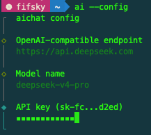

# aichat

一个简单的命令行ai agent，快速和 ai 对话并得到结果

## Usage

安装前请先安装 [Bun](https://bun.sh/)。

```bash
npm install -g @fifsky/aichat
ai --config
ai 今天天气怎么样
```

本地开发：

```bash
bun install
bun run build
./dist/ai --config
./dist/ai 今天天气怎么样
```

## 配置

首次使用可以通过交互式配置向导设置模型服务、模型名称、API Key 以及是否显示思考内容：

```bash
ai --config
```



也可以使用 `--set` 直接更新配置项：

```bash
ai --config --set provider.baseURL=https://api.deepseek.com --set provider.model=deepseek-v4-pro
```

配置路径为 `~/.config/aichat/aichat.json`。

完整配置示例：

```json
{
  "provider": {
    "name": "deepseek",
    "baseURL": "https://api.deepseek.com",
    "apiKey": "sk-xxx",
    "model": "deepseek-v4-pro",
    "thinking": {
      "enabled": true,
      "reasoningEffort": "high",
      "showReasoning": true
    }
  },
  "mcpServers": {
    "example": {
      "type": "stdio",
      "command": "npx",
      "args": ["-y", "@example/mcp-server"],
      "env": {}
    }
  },
  "skills": {
    "enabled": true,
    "dirs": ["~/.agents/skills"]
  },
  "tools": {
    "ask": {
      "enabled": true
    },
    "bash": {
      "enabled": true,
      "autoApprove": ["tvly *"],
      "timeoutMs": 60000
    }
  },
  "session": {
    "path": "~/.aichat/sessions/default.json",
    "maxMessages": 100
  }
}
```

## 清空上下文

对话上下文会保存在 `~/.aichat/sessions/default.json`，上下文最多保留 100 条消息。如果需要重新开始一次干净的对话，可以执行：

```bash
ai --clean
```

## Skills

ai agent会自动加载`~/.agents/skills`目录下的所有文件作为 skills, 并通过内置的 Bash 工具执行。

Bash 工具默认只自动批准`tvly *`，其他命令会在终端确认后执行。

## Ask 工具

当 AI 对需求理解不清晰、缺少必要决策时，会使用内置的 `ask` 工具向用户追问。Ask 使用 `@clack/prompts` 组件渲染终端交互，支持单选、多选和自定义输入；每个问题最多展示 5 个选项。如果需要澄清多个问题，AI 会按步骤逐个询问。
